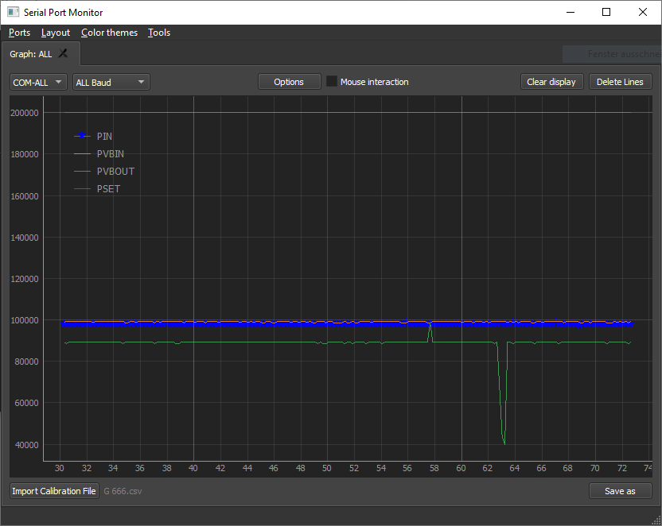

# RoDaq_QT

## Introduction
It is used as an experimentation software specifically for measuring, saving and displaying data via serial ports.
It was written as part of a bigger project for the "Technische Universität Dresden".



## Technologies used
This software is written using 
* PyQt5 (tested with version 5.15.7)
* Python3 (tested with 3.10.5)
* Windows or Linux

## Launch
The required packages can be get via "```pip install PACKAGE```"

## Features
* Thread safe reading and writing from and to serial ports
* Simple to use and intuitive design and handling
* Multiple ways to visualize data
* Multiple ways to process data
* Easy to maintain and extend

## Contributors
* Tim Henning (main contributors)
* Benjamin Kraus

## TODO
* Write documentation
* Fixing bugs
* Extensive testing with respect to performance
